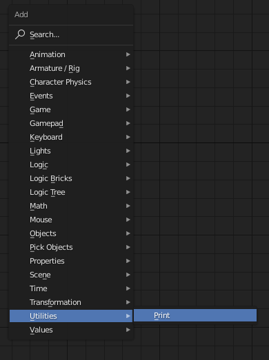
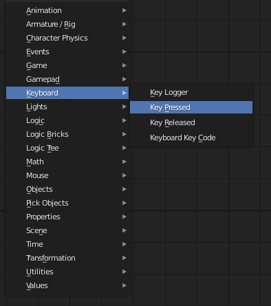
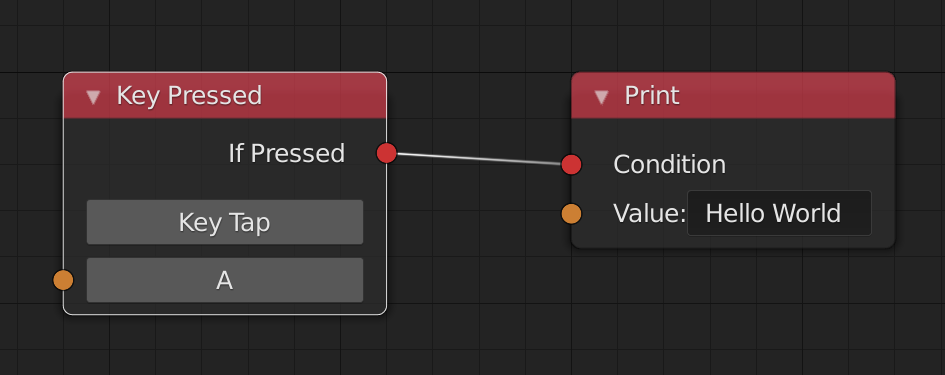

A Basic Example
=========================

In this example, we will set up a basic logic tree.
This tree will only have a few Nodes,
just to show how basic functionality can be achieved.

Creating a Logic Tree
----------------------

First, we need to create a logic tree. This is done by navigating to the
Logic Tree Editor in the View Context Menu (Where you'd navigate from
3D View to UV Editor for example)

There, click the button "Create New" to add an empty logic tree.
Now let's add some functionality.

Adding Nodes
-------------

First, we need to define an outcome - something that should be achieved
when this tree is activated. For now, let's say we want to print "Hello World"
to the console.

To do this, we can add a :samp:`Print` Node by pressing
:samp:`Shift + A` -> :samp:`Utilites` -> :samp:`Print`
and entering "Hello World" in the text area.

Now when we start the Engine, nothing happens. This is because the
Print action needs a condition to perform. Let's say we want to print
when the player presses :samp:`A`.

In this case, we need to add another Node, the :samp:`Key Pressed` Node.
This node is found in the :samp:`Keyboard` category. To define the button,
simply click on the Key Bar and press the :samp:`A` key.

Now connect the :samp:`Condition` socket of the :samp:`Key Pressed` Node to the
:samp:`Condition` socket of the :samp:`Print` Node.

Adding Trees to Objects
-----------------------

.. image:: ../images/helloworld/Apply_To_Selected.PNG
    :width: 200px
    :align: right

If we were to start the engine now, still nothing would happen. This is because
the tree has yet to be applied to an object in the active scene. 

To achieve this, simply select the object you want to apply the tree to in
the 3D View, and then in the Logic Tree Editor navigate to "Item" in the
Properties Panel (Press 'N') and click on *Apply to selected".

Check the outcome!
-----------------------

Now we just need to open the console by clicking *Window* ->
*Toggle System Console*.

.. image:: ../images/helloworld/Console.PNG
    :width: 600px
    :align: left

Now when starting the Game Engine and pressing :samp:`A`, a new line will be
printed in the console saying "Hello World".
